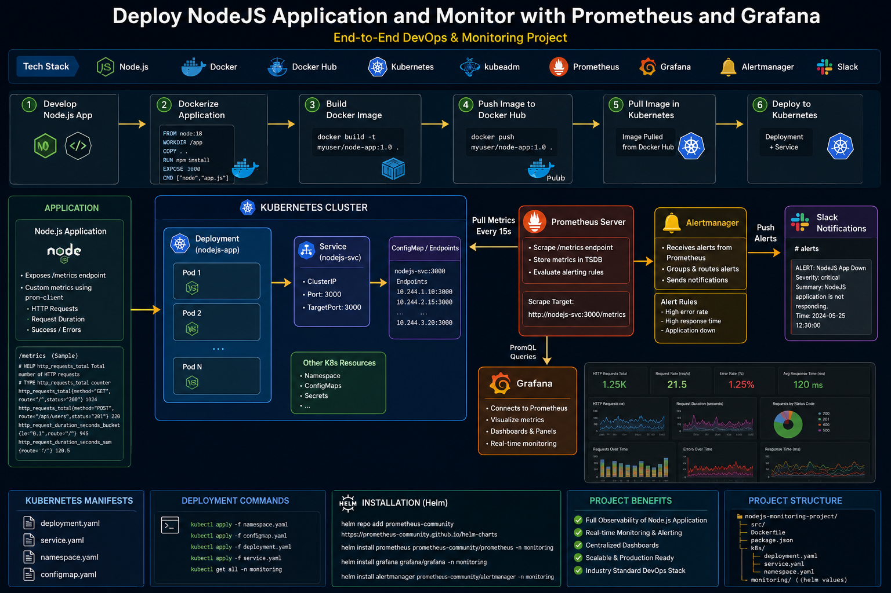

# Deploy NodeJS Application and Monitor with Prometheus & Grafana

## End-to-End DevOps & Monitoring Project

This project demonstrates a complete DevOps and Monitoring workflow using:

- Node.js
- Docker
- Docker Hub
- Kubernetes (kubeadm)
- Prometheus
- Grafana
- Alertmanager
- Slack Notifications

---

# Project Architecture



---

# Project Overview

This project shows how to:

- Develop a Node.js application
- Containerize the application using Docker
- Push Docker images to Docker Hub
- Deploy the application into Kubernetes
- Monitor application metrics using Prometheus
- Visualize metrics with Grafana
- Configure Alert Rules using PromQL
- Send alerts to Slack using Alertmanager

---

# Tech Stack

| Technology | Purpose |
|---|---|
| Node.js | Backend Application |
| Express.js | Web Server |
| Docker | Containerization |
| Docker Hub | Image Registry |
| Kubernetes | Container Orchestration |
| kubeadm | Kubernetes Cluster Setup |
| Prometheus | Metrics Collection |
| Grafana | Monitoring Dashboards |
| Alertmanager | Alert Routing |
| Slack | Notifications |

---

# Application Features

The Node.js application exposes custom Prometheus metrics using `prom-client`.

## Metrics Included

- HTTP Request Count
- Request Rate
- Application Metrics
- Default Node.js Metrics

## Metrics Endpoint

```bash
/metrics
```

---

# Dockerization

The application was containerized using Docker.

## Build Docker Image

```bash
docker build -t nodejs-app-prom .
```

## Push Image to Docker Hub

```bash
docker tag nodejs-app-prom USERNAME/nodejs-app-prom:v1
docker push USERNAME/nodejs-app-prom:v1
```

---

# Kubernetes Deployment

The application was deployed to Kubernetes using:

- Deployment
- Service
- ServiceMonitor
- PrometheusRule
- AlertmanagerConfig

## Deploy Application

```bash
kubectl apply -f nodejs-app.yml
kubectl apply -f nodejs-svc.yml
```

---

# Monitoring with Prometheus

Prometheus automatically scrapes metrics from the application using:

- ServiceMonitor
- Prometheus Operator

## Prometheus Target

```bash
http://nodejs-svc:3000/metrics
```

---

# Grafana Dashboards

Grafana is connected to Prometheus for:

- Real-time Monitoring
- Metrics Visualization
- Dashboard Panels
- Performance Analysis

---

# Alerting System

Custom alert rules were configured using PromQL.

## Example Alert Rule

```promql
rate(http_requests_root_total[5m]) > 10
```

## Alert Features

- High Request Rate Detection
- Real-Time Alerting
- Slack Notifications
- Alertmanager Routing

---

# Slack Integration

Alertmanager sends alerts directly to Slack channels using Webhooks.

Example alerts include:

- High Request Rate
- Application Down
- Performance Issues

---

# Kubernetes Resources

## Deployment

Manages application Pods and replicas.

## Service

Exposes the application inside Kubernetes.

## ServiceMonitor

Allows Prometheus to discover application metrics.

## PrometheusRule

Defines custom alert rules.

## AlertmanagerConfig

Configures Slack alert notifications.

---

# Project Structure

```bash
nodejs-monitoring-project/
│
├── Dockerfile
├── README.md
├── index.js
│
├── k8s/
│   ├── nodejs-app.yml
│   ├── nodejs-svc.yml
│   ├── nodejs-monitor.yml
│   ├── nodejs-rule.yml
│   └── nodejs-alert-manager.yml
```

---

# Useful Commands

## Check Pods

```bash
kubectl get po
```

## Check Services

```bash
kubectl get svc
```

## Check Prometheus Targets

```bash
kubectl get servicemonitor -n monitoring
```

## Check AlertmanagerConfig

```bash
kubectl get alertmanagerconfig -n monitoring
```

---

# Project Benefits

- Full Observability
- Real-Time Monitoring
- Kubernetes Native Monitoring
- Scalable Architecture
- Production-Style Monitoring Stack
- Automated Alerting System

---

# Future Improvements

- GitHub Actions CI/CD
- Ingress Controller
- Loki + Promtail Logging
- ArgoCD GitOps
- Terraform Infrastructure

---

# Author

Mohammad AL-Samada
